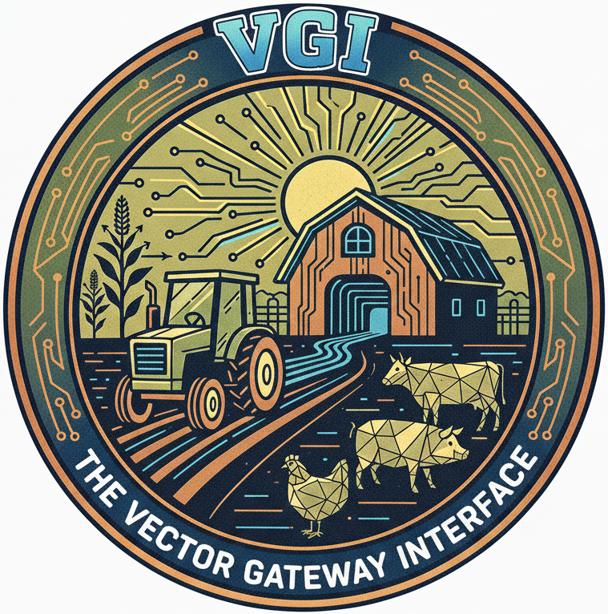

# VGI (Vector Gateway Interface)

<p align="center">
  
</p>

<p align="center">
  <strong>Apache Arrow-based protocol for extending DuckDB using any language.</strong><br/>
  <strong>No C++/C/Zig/Rust or compilation/linking required (unless you want to).</strong>
</p>

<p align="center">
  Created by <a href="https://query.farm">Query.Farm</a>
</p>

---

## See It in Action

```python
# my_worker.py
from typing import Annotated
from vgi import ScalarFunction, Param, Returns, Worker
import pyarrow as pa
import pyarrow.compute as pc

class Greeting(ScalarFunction):
    """Generate a greeting for each name."""

    @classmethod
    def compute(
        cls,
        name: Annotated[pa.StringArray, Param(doc="Column containing names")],
    ) -> Annotated[pa.StringArray, Returns()]:
        return pc.binary_join_element_wise("Hello, ", name, "!")

class MyWorker(Worker):
    functions = [Greeting]

if __name__ == "__main__":
    MyWorker().run()
```

```sql
-- First time only.
INSTALL vgi FROM COMMUNITY;
LOAD vgi;
ATTACH 'my_worker' (TYPE 'vgi', LOCATION './my_worker.py');

SELECT greeting(name) FROM users;
-- "Hello, Alice!"
-- "Hello, Bob!"
```

Or you can launch the DuckDB CLI with

`duckdb vgi:my_worker.py` to start a new session with the functions you just added.

That's it. No C++ compilation, no extension versioning, no complex build process. Just a Python script that DuckDB can call.

---

## Installation

```bash
pip install vgi
```

Or with [uv](https://github.com/astral-sh/uv):

```bash
uv add vgi
```

---

## Why VGI?

VGI lets you extend DuckDB with Python functions that run in separate processes, communicating via Apache Arrow IPC. This means:

| Traditional Extensions | VGI Workers |
|----------------------|-------------|
| C/C++ compilation required | Any language but first Python and Typescript and Go |
| Tied to DuckDB version | Version independent |
| Complex build/release cycle | Ship a script or executable |
| Runs in-process | Process isolation |
| Single-threaded | Parallel workers |

**Use cases:**
- Call REST APIs or external services from SQL
- Run ML inference (PyTorch, scikit-learn, etc.)
- Process data with Python libraries (pandas, numpy)
- Build custom ETL transforms
- Create domain-specific functions for your team
- Expose external data sources as queryable tables and views

---

## Quick Start

### Step 1: Create a Worker

A worker is a Python script that defines one or more functions:

```python
#!/usr/bin/env python
# my_worker.py
from typing import Annotated
import pyarrow as pa
import pyarrow.compute as pc
from vgi import ScalarFunction, Param, Returns, Worker


class UpperCase(ScalarFunction):
    """Convert string values to uppercase."""

    @classmethod
    def compute(
        cls,
        value: Annotated[pa.StringArray, Param(doc="String value to uppercase")],
    ) -> Annotated[pa.StringArray, Returns()]:
        return pc.utf8_upper(value)


class MyWorker(Worker):
    catalog_name = "my_funcs"
    functions = [UpperCase]


if __name__ == "__main__":
    MyWorker().run()
```

### Step 2: Use from DuckDB

```sql
-- Attach the worker as a catalog
ATTACH 'my_funcs' (TYPE 'vgi', LOCATION './my_worker.py');

-- Call your function
SELECT upper_case(name) FROM users;

-- Use in complex queries
SELECT id, upper_case(status) as status
FROM orders
WHERE created_at > '2024-01-01';
```

### Step 3: There is no step 3

Your function is now available in DuckDB. Ship the Python script to your team, and they can use it immediately.

---

## Going Further: Type-Safe Arguments

For production use, you'll want type validation. Use `Param` with `type_bound` to ensure columns have the correct type:

```python
from typing import Annotated
from vgi import ScalarFunction, Param, Returns, Worker
import pyarrow as pa
import pyarrow.compute as pc


class AddValues(ScalarFunction):
    """Add two integer values together."""

    @classmethod
    def compute(
        cls,
        left: Annotated[pa.Int64Array, Param(type_bound=pa.types.is_integer, doc="First integer value")],
        right: Annotated[pa.Int64Array, Param(type_bound=pa.types.is_integer, doc="Second integer value")],
    ) -> Annotated[pa.Int64Array, Returns()]:
        return pc.add(left, right)
```

```sql
SELECT add_values(price, tax) as total FROM orders;

-- This would fail at bind time with a clear error:
-- SELECT add_values(name, price) FROM orders;
-- Error: Column 'name' has type string, expected integer
```

Key features of the `Param`/`Returns` API:
- Types are inferred from PyArrow array annotations (`pa.Int64Array` -> `pa.int64()`)
- `type_bound` validates the column's Arrow type at bind time
- `ConstParam` receives scalar values (not columns) from SQL arguments
- `Returns` declares the output type

---

## Function Types

VGI supports three function types:

| Type | Base Class | SQL Pattern | Use Case |
|------|------------|-------------|----------|
| **Scalar** | `ScalarFunction` | `SELECT func(col) FROM t` | Per-row transforms (1:1) |
| **Table** | `TableFunctionGenerator` | `SELECT * FROM func(args)` | Generate data |
| **Table-In-Out** | `TableInOutFunction` | `SELECT * FROM func((SELECT ...))` | Aggregation, filtering |

### Scalar Functions

Transform each row independently. Output has the same number of rows as input.

```python
class Double(ScalarFunction):
    """Double an integer value."""

    @classmethod
    def compute(
        cls,
        value: Annotated[pa.Int64Array, Param(doc="Value to double")],
    ) -> Annotated[pa.Int64Array, Returns()]:
        return pc.multiply(value, 2)
```

### Table Functions

Generate output data from arguments (no input table). Each call to `process()` emits
a batch via `out.emit()` or signals completion via `out.finish()`.

```python
from dataclasses import dataclass
from typing import Annotated, ClassVar
import pyarrow as pa
from vgi import TableFunctionGenerator, Arg
from vgi.table_function import ProcessParams, OutputCollector


@dataclass
class CounterState:
    remaining: int
    current: int = 0


class Counter(TableFunctionGenerator):
    """Generate a sequence of integers."""

    count: Annotated[int, Arg(0, doc="Number of rows to generate")]
    FIXED_SCHEMA: ClassVar[pa.Schema] = pa.schema([("n", pa.int64())])

    @classmethod
    def initial_state(cls, params: ProcessParams) -> CounterState:
        return CounterState(remaining=params.args.count)

    @classmethod
    def process(cls, params: ProcessParams, state: CounterState, out: OutputCollector) -> None:
        if state.remaining <= 0:
            out.finish()
            return
        batch_size = min(state.remaining, 1000)
        values = list(range(state.current, state.current + batch_size))
        out.emit(pa.RecordBatch.from_pydict({"n": values}, schema=params.output_schema))
        state.current += batch_size
        state.remaining -= batch_size
```

### Table-In-Out Functions

Transform or aggregate input data. Override `transform()` for per-batch processing
and `finish()` for final output after all input is consumed.

```python
import pyarrow as pa
import pyarrow.compute as pc
from vgi import TableInOutFunction


class FilterPositive(TableInOutFunction):
    """Keep only rows where all numeric columns are positive."""

    @property
    def output_schema(self) -> pa.Schema:
        return self.input_schema

    def transform(self, batch: pa.RecordBatch) -> pa.RecordBatch:
        mask = None
        for i, field in enumerate(batch.schema):
            if pa.types.is_integer(field.type) or pa.types.is_floating(field.type):
                col_mask = pc.greater(batch.column(i), 0)
                mask = col_mask if mask is None else pc.and_(mask, col_mask)
        if mask is not None:
            return pc.filter(batch, mask)
        return batch
```

---

## Beyond Functions: Full Catalog Support

VGI workers can expose more than just functions. A worker can provide a complete database catalog with:

- **Schemas** - Organize objects into namespaces
- **Tables** - Expose external data as queryable tables
- **Views** - Define SQL views over your data
- **Functions** - Scalar, table, and table-in-out functions

```sql
ATTACH 'external_db' (TYPE 'vgi', LOCATION './my_catalog_worker.py');

-- Query tables from the attached catalog
SELECT * FROM external_db.main.users;

-- Use views
SELECT * FROM external_db.analytics.daily_summary;

-- Call functions
SELECT external_db.main.transform(col) FROM my_table;
```

This enables VGI workers to act as bridges to external systems—databases, APIs, file systems—presenting them as native DuckDB catalogs.

See [Catalog Interface](docs/catalog-interface.md) for implementation details.

---

## Parallel Execution

Functions can run across multiple worker processes. The client automatically
distributes input batches round-robin across workers and collects results.

See [Function API Reference](docs/generator-api.md) for advanced patterns like distributed aggregation.

---

## Error Handling

Errors in your functions propagate to DuckDB with clear messages:

```python test="skip"
@classmethod
def compute(cls, value: Annotated[pa.Int64Array, Param()]) -> Annotated[pa.Int64Array, Returns()]:
    raise ValueError("Something went wrong")
```

```sql
SELECT my_func(col) FROM my_table;
-- Error: Something went wrong
```

Type bound violations are caught at bind time (before processing starts):

```sql
SELECT add_values(name, price) FROM orders;
-- Error: Argument 'left': Column 'name' has type string,
--        but type bound requires: is_integer
```

---

## Testing Your Functions

Use the VGI client for integration tests:

```python
from vgi.client import Client
from vgi import Arguments
import pyarrow as pa

batch = pa.RecordBatch.from_pydict({"name": ["alice", "bob"]})

with Client("./my_worker.py") as client:
    results = list(client.scalar_function(
        function_name="upper_case",
        input=iter([batch]),
        arguments=Arguments(positional=[pa.scalar("name")]),
    ))

assert results[0]["result"].to_pylist() == ["ALICE", "BOB"]
```

---

## Protocol Overview

VGI uses `vgi_rpc`, an Apache Arrow IPC-based RPC framework, for all
client-worker communication over stdin/stdout pipes:

```
Client                              Worker
  │                                   │
  │──── bind(request) ──────────────▶ │  Function name, args, input schema
  │◀─── BindResponse ────────────────  │  Output schema, opaque data
  │                                   │
  │──── init(request) ──────────────▶ │  Start processing stream
  │◀─── Stream header ───────────────  │  execution_id, max_workers
  │                                   │
  │──── exchange(batch1) ───────────▶ │
  │◀─── output batch 1 ──────────────  │  transform(batch)
  │         ...                       │
  │──── [stream close] ─────────────▶ │  Signal end of input
  │                                   │
  │──── init(phase=FINALIZE) ───────▶ │  Start finalize stream
  │◀─── final output batches ────────  │  finish() results
  └───────────────────────────────────┘
```

---

## Documentation

- [Function Lifecycle](docs/lifecycle.md) - Bind, init, process, finalize
- [Metadata API](docs/metadata.md) - Function introspection
- [Function API Reference](docs/generator-api.md) - Advanced function patterns
- [Catalog Interface](docs/catalog-interface.md) - DuckDB ATTACH integration

---

## Development

```bash
git clone https://github.com/query-farm/vgi-python
cd vgi-python

uv sync --all-extras        # Install dependencies
uv run pytest -n auto       # Run tests
uv run ruff check --fix .   # Lint
uv run ruff format .        # Format
uv run mypy vgi/            # Type check
```

## Requirements

- Python >= 3.12.4
- pyarrow
- DuckDB (for SQL integration)

---

## License

Copyright 2025-2026 Query.Farm LLC. All Rights Reserved.

This code is currently restrictively licensed. Contact [Query.Farm](https://query.farm) for licensing information.
