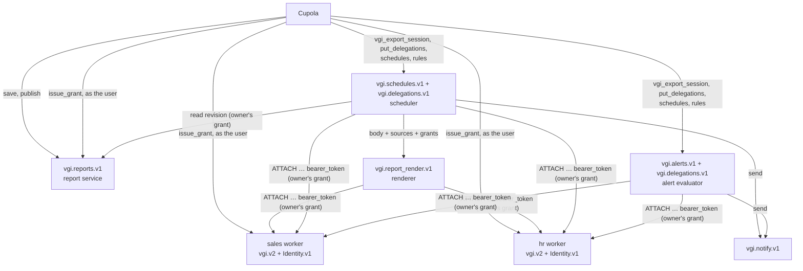

# Reporting protocols: reports, rendering, scheduled actions, alerts, notifications

Status: draft for review · revised 2026-10-06 (second review: simplified)

Seven optional, separately versioned vgi-rpc protocols that any VGI worker or
standalone service may host:

| Protocol | Job | Methods | Spec |
| --- | --- | --- | --- |
| `vgi.reports.v1` | Report store: revisions, publishing, redaction | 9 | [reports.md](reports.md) |
| `vgi.report_render.v1` | Render a report body into PDF, HTML or PNG | 4 | [render.md](render.md) |
| `vgi.schedules.v1` | Run an action (render a report, run a query, a vendor kind) on a trigger, as its owner, with an optional condition and deliveries | 12 | [schedules.md](schedules.md) |
| `vgi.alerts.v1` | Rules whose query returns the rows meeting a condition; one stateful instance per key; acknowledge, snooze, subscribe | 16 | [alerts.md](alerts.md) |
| `vgi.notify.v1` | Deliver a message to email, Slack, Teams, Discord or a webhook | 4 | [notify.md](notify.md) |
| `vgi.sql_tasks.v1` | Run SQL that changes data on a trigger: load a query into a table (replace, append, merge, snapshot), incrementally by watermark, or a script of statements and `CALL`s in one transaction | 13 | [sql_tasks.md](sql_tasks.md) |
| `vgi.delegations.v1` | Hold an owner's delegations (grant + attach ticket per catalog) for unattended work | 3 | [credentials.md](credentials.md) |

Cupola's localStorage reports become the first client. The groundwork shipped
in every vgi-rpc port and VGI SDK ([prerequisites.md](prerequisites.md)):
multi-protocol hosting, the gRPC error model, `Identity.v1` everywhere, and
grants accepted as bearer credentials.

## Design rules

1. **The protocol is the unit of optionality.** A host serves a protocol whole
   or not at all; every method is required. What varies between hosts is data
   in `get_*_info` (e.g. `writable`), never the method set.
2. **Composable across hosts.** Nothing assumes co-location. A report can read
   catalogs on several workers, live on a third, be scheduled on a fourth and
   rendered on a fifth. What makes that work is two shared types in
   [credentials.md](credentials.md): a portable **session description**
   (`DataSource` list) and **delegations**: a grant plus a worker-sealed
   attach ticket per catalog, from `vgi_export_session()`.
3. **Wire contract only.** Each spec says what crosses the wire and what a
   client can rely on. How the reference implementation builds its engine
   (leases, ticks, warm sessions, retries, retention) is in clearly marked,
   non-normative notes.
4. **Delegated grants are the only unattended data credential.** No service
   account ever reads data. Service principals exist only to call
   infrastructure (a scheduler calling notify's `send`).

## Decisions

| Topic | Decision |
| --- | --- |
| Where reports live | Any host may implement `vgi.reports.v1`; a dedicated report service is the expected enterprise shape. A report names any number of catalogs in `data_sources`. |
| Report body | Standard envelope (title, path, tags, data sources, parameters); the body is opaque bytes tagged with a format such as `cupola.evidence/1`. |
| History | Append-only numbered revisions, one published pointer, tombstone redaction. Drafts and restore are client-side. |
| Access control | Each implementation's. The protocols carry advisory `allowed_actions` and standard refusals, not ACL management. |
| Data access | Any host may run a session: the scheduler, the renderer, an alert evaluator, any worker. A session is rebuilt anywhere from its `DataSource` list plus the owner's grants, with one `ATTACH … bearer_token` per source. |
| Unattended sessions | The client serializes the user's attached session with `vgi_export_session()`: per catalog, a grant (who) and an attach ticket (what, sealed by the worker, secrets included). Held as delegations, per owner per catalog (`vgi.delegations.v1`) by each host that runs unattended work; any runner reattaches with `ATTACH … (bearer_token, attach_ticket)`. Schedules and rules carry no credentials. Lifetime is each data worker's policy; the framework default becomes unlimited unless a worker sets a maximum. |
| Scheduling | Generic actions: `render_report`, `run_query`, and `<vendor>.<name>` kinds. Optional `condition_sql` returns one boolean. Triggers are cron or once on the wire; presets are UI. |
| Report versions in schedules | The owner pins a revision, or follows the published revision or head and accepts that later edits run with their grants. |
| SQL tasks | Their own protocol on the shared engine, for SQL that changes data; schedules produce and deliver outputs. Bodies are a declarative `load` or a `script`; a `CALL` is a statement. Targets are any writable catalog (under the owner's delegation) or the host's own store. Watermarks are derived from the target (exactly once) or stored (at least once). One written database per transaction. |
| Alerts | Their own protocol. Rows are instances; notify on transitions; subscriptions with link-only details unless the owner shares them; acknowledge per instance, snooze per instance or rule, always with an end. |
| Delivery | `vgi.notify.v1`, channel-agnostic. Each service owns its destination policy and unsubscribe list. |
| Serverless | The reference scheduler is driven by an operator `tick` that a platform cron can call over HTTP; this is reference implementation, not protocol ([schedules.md](schedules.md#reference-scheduler-non-normative)). |
| SQL access | Normative. Each protocol is also a schema in the host's VGI catalog: every method is a table function, annotated lists are tables, annotated create/update/delete back `INSERT`/`UPDATE`/`DELETE`, other verbs are procedures. Derived from the RPC definition by a generic adapter, never hand-written, so the two surfaces can't drift. |
| Naming | Report-only protocols are scoped (`vgi.report_render.v1`, later `vgi.report_sharing.v1`); the rest are general. |
| Discovery | Reflection for what an endpoint hosts; one catalog tag per protocol for where services live. |

## Context

**Cupola reports today** (`vgi-web-frontend/src/lib/evidence/`): one
zod-validated JSON document per report (Evidence Markdown `source`, `setupSql`,
typed parameters, appearance and a single `serviceUrl`) in localStorage, keyed
per worker and per browser. History is a list of revisions with no author;
sharing is exporting a file; PDF export is built from the live DOM. Other
catalogs a report queries are referenced by alias in SQL and never declared.

**What vgi-rpc and the SDKs give us** (shipped 2026-10-06):

- `Worker.hosted_protocols()` hosts extra protocols on every transport;
  `vgi_rpc.Reflection.v1` `list_protocols` says which.
- Errors carry `error_code`, `error_kind` and typed `error_details`; clients
  expose `is_retryable()` and never retry automatically.
- `vgi_rpc.Identity.v1` `issue_grant` mints a delegated credential for the
  calling principal (login no older than 900 s), and a worker with grant keys
  accepts its own sealed `vgig1.` grants as `Authorization: Bearer`.
- VGI's `ATTACH` takes a `bearer_token` option, treated as a secret.

## Goals

1. A report has one durable identity that any authorized person can open from
   any browser or client.
2. Every saved change is an immutable, numbered revision with an author;
   publishing gives readers a stable version while editors keep working.
3. A report can query any number of VGI workers and declares which.
4. Reports, queries and other actions run on a schedule without a browser, as
   their owner, optionally only when a condition holds, and deliver to email,
   chat or webhooks.
5. People get alerted when data meets a condition, once per affected entity,
   with the values that triggered it.
6. Each protocol is optional and easy to implement; a worker can ship read-only
   reports from files in one line.

## Non-goals for v1

- ACL management (a later `vgi.report_sharing.v1`), a standard report body,
  users/groups/tenants (they come from the identity provider), bulk messaging,
  named publish channels, server-side drafts, and server implementations in
  every port (servers ship in Python and TypeScript; other ports get generated
  client types).

## Architecture



The boxes are roles, not deployments: one process may host several of them
(the reference `vgi-report-serve` hosts reports, schedules, SQL tasks, alerts and
delegations), or each may be its own service. Every arrow carrying data access uses
the owner's grant for the location it goes to, and nothing else.

## Shared conventions

**Naming and versioning.** `vgi.<name>.v1`, `protocol_version = "1.0.0"`.
Minor versions only add methods or defaulted fields; breaking changes ship as
`.v2`, hosted side by side. No unions on the wire: every choice is an explicit
`kind` field plus plain values.

### Errors

Every refusal is a vgi-rpc error with a canonical code, a reason
(`error_kind`) and catalog details. Kinds are shared across the protocols.

| `error_kind` | `error_code` | Details | Client behaviour |
| --- | --- | --- | --- |
| `not_found` | `NOT_FOUND` | `ResourceInfo`; optional access hint | Show "Ask {contact} for access" when a hint is present |
| `action_denied` | `PERMISSION_DENIED` | `ErrorInfo.metadata {action}` | Explain; don't retry |
| `read_only_service` | `PERMISSION_DENIED` | `ResourceInfo` | Hide editing; `writable` should already have said so |
| `conflict` | `ABORTED` | `ResourceInfo`, `ErrorInfo.metadata` with the current version or head (`head_revision_id`, `updated_by`, `updated_at`) | Reload, then review, reapply or save as a copy |
| `invalid_request` | `INVALID_ARGUMENT` | `BadRequest` | Show field-level detail |
| `grant_required` | `FAILED_PRECONDITION` | `PreconditionFailure`, one `{type: "GRANT", subject: <location>}` per location | Connect or reauthenticate those sources |
| `quota_exceeded` | `RESOURCE_EXHAUSTED` | `QuotaFailure`; `RetryInfo` for rate limits | Show the limit |
| `service_unavailable` | `UNAVAILABLE` | `RetryInfo` (required) | Retry with backoff; never cache |

The access hint on `not_found` is `LocalizedMessage`, `Help.links` (request
access) and `ErrorInfo.metadata.access_contact`; no custom detail type.

**Visibility.** Return `not_found` for objects the caller can't read, so ids
can't be probed; list methods filter by read permission.

**Permission hints.** Returned objects carry `allowed_actions` for the caller:
`read`, `edit`, `publish`, `redact`, `delete`, `schedule`, `run`, `manage`, plus
alert actions. Advisory; the server enforces on every call.

**Principals.** Authorship is `PrincipalRef {id, display_name, email}`, `id`
being `AuthContext.principal`.

**Concurrency and idempotency.** Mutations of existing objects take
`expected_revision_id` or `expected_version` (`conflict` on mismatch). Creates,
sends and runs take a client-chosen `request_id`; a repeat within 24 hours
returns the original result.

**Lists** are producer streams with a fixed Arrow schema, paged by continuation
tokens. **Times** are `timestamp[us, UTC]` with IANA zone names. **Parameter
values** are tagged `ParamValue` records whose literal payload is JSON text.
**`body_sha256`** is over the body bytes as sent.

**Transports.** Hosted on every transport through `hosted_protocols()`. On
HTTP callers have identities; on stdio and unix the caller is the operator,
which suits tests and single-user tools. Grants are HTTP only.

## Unattended sessions across workers

The full model is in [credentials.md](credentials.md). In short:

- **Serialize:** while logged in, the client runs `vgi_export_session()`. Each
  attached worker returns a grant (who) and an attach ticket (what: the
  attachment's options, secrets included, sealed so only that worker can open
  them). Only catalogs the user attached themselves are exported.
- **Store:** each host that runs unattended work keeps the owner's delegations,
  per catalog, via `put_delegations`. Never returned.
- **Reattach:** any runner attaches each report source with
  `ATTACH … (bearer_token '<grant>', attach_ticket '<ticket>')`, only at the
  delegation's own location, only for that job. It never sees an option or secret.

**Known limits:**

- Grants carry no identity-provider claims. A claim-based `AccessPolicy`, on a
  data worker or the report store, sees unattended work with none and must
  decide from the principal or fail closed.
- Scopes are advisory; by default a grant is as powerful as its owner on that
  worker.
- Non-VGI attachments (files, `:memory:`, other database types) can't be
  serialized.
- With no maximum lifetime set, grants and tickets never expire and are revoked
  by revoking the delegation or rotating the worker's grant key.

## Discovery

1. **Reflection.** `list_protocols` on an endpoint says which protocols it
   hosts. Clients never probe by calling and catching.
2. **Catalog tags.** A worker that relies on services elsewhere returns them in
   `CatalogAttachResult.tags`, one per protocol, following
   `vgi_secret_service_url`: `vgi_reports_url`, `vgi_report_render_url`,
   `vgi_schedules_url`, `vgi_alerts_url`, `vgi_notify_url`. Values must be https
   (localhost excepted) and same-site or on an operator allowlist; the client
   confirms each with reflection.

When catalogs in one session point at different report services, each report
lives in exactly one, and the library groups by service.

## SQL binding

Every protocol here except the scheduler driver is also usable from SQL. A host
that serves a protocol over vgi-rpc and also serves `vgi.v2` exposes the same
protocol as a schema in its VGI catalog, so after

```sql
ATTACH 'ops' (TYPE vgi, LOCATION 'https://reports.example.com');
```

`ops.sql_tasks.tasks` lists tasks, `INSERT INTO ops.schedules.schedules …`
creates a schedule, and `CALL ops.sql_tasks.run_now(task_id := '…')` runs one.
The binding is normative: SQL written against one implementation runs against
another.

**It is derived, never hand-written.** The SQL binding is a function of the RPC
definition plus a small per-protocol annotation (which list is a table, which
methods back its `INSERT`, `UPDATE` and `DELETE`). Implementations write the RPC
service only; a generic adapter in each SDK serves the catalog from it, so the
two surfaces cannot drift. Each spec's "SQL binding" section is that
annotation, and nothing else.

### Derivation rules

1. **Schema.** `vgi.<name>.v1` is the schema `<name>`; a `.v2` hosted beside it
   is `<name>_v2`. A host that serves several protocols has one schema each.
2. **Every method is a table function**, named as the method, with the method's
   parameters as named arguments and its result as rows: a unary method returns
   one row (or one row per list element it returns), a stream returns its
   batches. `CALL` invokes them. This rule is total: no method is left out, so
   nothing reachable over RPC is unreachable from SQL.
3. **`get_*_info()` is also the one-row table `info`.**
4. **A list method may be annotated as a table**, named for its resource.
   Columns are the list's row schema exactly. Filters on columns that match the
   method's arguments are pushed down to them; every other filter is applied by
   DuckDB after the scan. A list with a required argument is never a table; it
   stays a table function.
5. **Fetched columns.** A table may name a get method. Columns only that method
   returns (a report's `body`) appear in the table but are fetched per row only
   when a query selects them.
6. **DML is annotated, per table.** `INSERT` calls the create method (one call
   per row, or one call per statement when the method takes a list); `UPDATE`
   calls the update method with the row as changed, passing the row's old
   `version` (or revision id) as the expected value; `DELETE` calls the delete
   method the same way. Arguments the method takes beyond the row (`request_id`,
   a commit `message`) are extra columns: writable, `NULL` on read. `DELETE`
   can't set columns, so it uses those arguments' defaults; a delete that needs
   one (`drop_target`) is a `CALL`. A table without an annotation is read-only.
   A verb that
   isn't create, update or delete (`publish`, `run_now`, `acknowledge`) is only
   ever a procedure, so `SELECT` never has side effects.
7. **Types are the RPC's.** The RPC already speaks Arrow: records are
   `STRUCT`s, lists are `LIST`s, `kind` fields are `VARCHAR`. Field names are
   column names verbatim, so an RPC field name must be one DuckDB accepts
   unquoted (`grant` is fine; check new names against DuckDB's keyword list).
8. **Write-only fields** (grants, tickets) are accepted by `INSERT` and read
   back as `NULL`.
9. **Identity and access** are the ATTACH's: the same caller, the same
   `AccessPolicy`, the same `not_found` for objects the caller can't read.

### Semantics

- **Concurrency.** An `UPDATE` or `DELETE` whose row changed since the scan read
  it fails with `conflict`, as over RPC.
- **Idempotency.** `request_id` is an optional `INSERT` column; left `NULL`, the
  adapter generates one, and the insert is then not retry-safe.
- **Autocommit.** Each row's call takes effect when the statement executes and
  `ROLLBACK` can't undo it, so mutations are refused inside an explicit
  multi-statement transaction (`invalid_request`). Reads are allowed anywhere.
  A statement that fails part-way reports how many rows it applied.
- **Errors.** The SQL error text is `[<error_kind>] <message>`, followed by the
  catalog details as JSON, so a script can still tell `conflict` from
  `grant_required` and which locations need a grant.
- **One written database per transaction** applies as everywhere in DuckDB: a
  statement that writes a protocol table writes nothing else.

### Drift guards

- The adapter builds the catalog from the RPC protocol class at startup; there
  is no second definition to keep in step.
- `scripts/regen_generated.py --check` regenerates each spec's binding tables
  from the protocol classes and annotations, as it does for the `vgi.v2`
  registry.
- Each protocol's conformance suite runs over both surfaces, and the extension
  runs cross-SDK sqllogictests for every binding (`test/sql/integration/
  <protocol>/`).

## Developer experience

```python
from pathlib import Path

from vgi.reports import AccessPolicy, ReadOnlyReportStore, ReportsProtocol
from vgi.reports.storage import SharedStorageReportStore
from vgi.worker import Worker


class SalesWorker(Worker):
    functions = [...]

    @classmethod
    def hosted_protocols(cls):
        # Ship .cupola-reports.json exports as read-only reports.
        return [(ReportsProtocol, ReadOnlyReportStore.from_files(Path(__file__).parent / "reports"))]


class TeamWorker(Worker):
    functions = [...]

    @classmethod
    def hosted_protocols(cls):
        return [(ReportsProtocol, SharedStorageReportStore.from_env(policy=OwnerPolicy()))]


class OwnerPolicy(AccessPolicy):
    def allowed_actions(self, auth, report) -> set[str]:
        if report.created_by.id == auth.principal:
            return {"read", "edit", "publish", "redact", "delete", "schedule"}
        return {"read", "schedule"} if report.published_revision_id else set()
```

`AccessPolicy` is the one function an implementor writes to own access, and it
decides from `auth.principal`, so it works for unattended (grant) callers too.
Reference stores sit on `FunctionStorage`, so sqlite, Azure SQL and Cloudflare
Durable Objects come free. **Conformance** is per protocol: every method, the
error mapping, concurrency, idempotency and authorship; pytest parameterized by
URL so the TypeScript implementation runs it too.

## Implementation plan

The build plan, its status and the decisions made along the way are in
[IMPLEMENTATION.md](IMPLEMENTATION.md). It is the single source for what to
build next.

## Review history

**First review** (principal engineer, BI UX lead, DX lead): grants accepted as
bearers (shipped), credentials bound to locations, run uniqueness, no unions,
the gRPC error model, `test_run`, plain-English trigger previews, structured
run errors, `label`s on data sources, `writable` services.

**Second review** (senior engineer, simplification and composability). Taken:

| Finding | Change |
| --- | --- |
| Three shapes for one credential, keyed by alias | One `Delegation` per owner per catalog; `DataSource` is the shareable description |
| Grants per schedule: renewal toil, and `purpose` named a schedule id before it existed | Per owner per catalog in `vgi.delegations.v1`, minted by `vgi_export_session()` |
| Minting at author-controlled locations leaks the user's session | Mint only at attached or confirmed locations |
| "Same grant" for the secret service can't verify there | Replaced by worker-sealed attach tickets, which carry secret options without exposing them |
| Report sources copied at schedule creation go stale | Taken from the revision rendered, every run |
| Claim-based policies on the report store fail for grant callers | Documented; reference `AccessPolicy` decides by principal |
| Notify assumed co-location (unsubscribe, attachments) | Notify owns the suppression list; attachments use signed URLs |
| Server drafts, publications log, undelete, copied_from, labels | Removed; reports 15 → 9 methods |
| Trigger presets and misfire policy on the wire | Cron or once; presets are UI |
| Engine rules (driver, leases, retries, retention, session hardening, grouping) as protocol | Moved to non-normative reference notes |
| Merges | `publish` unpublishes; `set_enabled`, `reauthorize`, `retry_run` folded in; one `conflict` kind; `set_acknowledged`; no `get_notification` or `partial_ok` |

Not taken, by decision: custom action kinds stay; alert subscriptions stay;
schedules may follow a report's latest revision as an accepted risk; the
unlimited default grant lifetime stands.

## Resolved questions

| Question | Answer |
| --- | --- |
| Features in `protocol_hash`? | Moot: `features` is always empty |
| Publish channels? | One pointer |
| History removal? | Tombstone redaction |
| Grant lifetime? | The worker's; framework default unlimited unless set |
| DuckDB tables? | Yes, on the reference service, read-only |
| Artifact retention? | Operator policy (reference: 90 days) |
| Tags? | One flat tag per protocol |
| Notify host? | New `vgi-notify` repo |
| Scheduling others' reports? | Anyone with `schedule`; runs as its owner; pin or follow |
| Where data access runs? | Anywhere; sessions are portable |
| Grant storage? | Per owner per location |

## Open questions

None outstanding.
