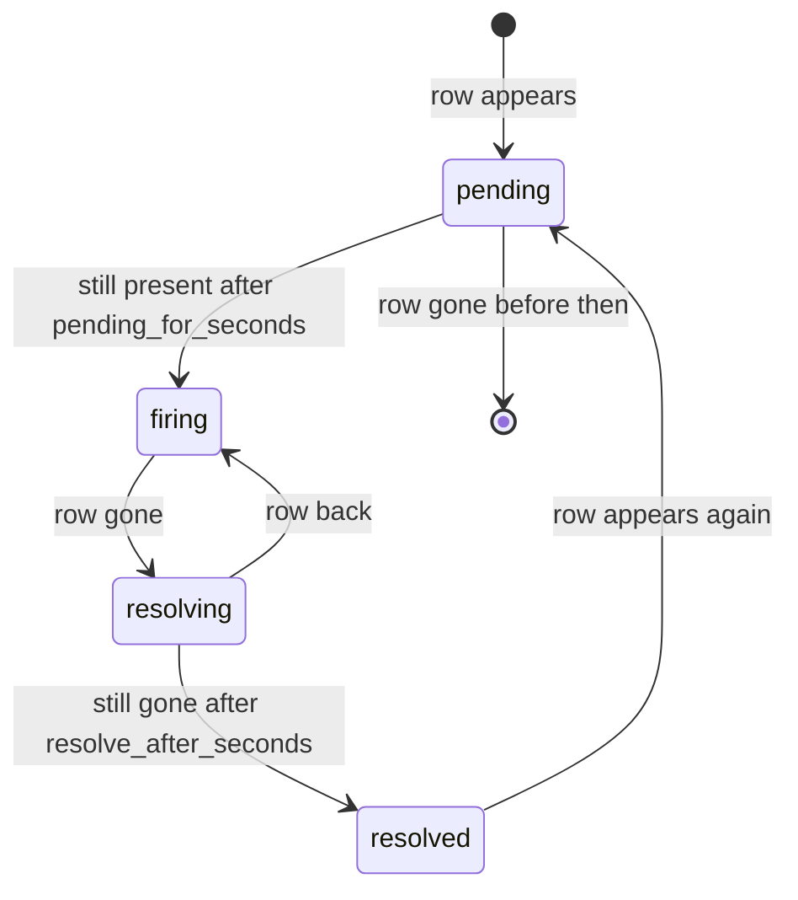

# vgi.alerts.v1

Python dataclasses and RPC interface: [generated reference](reference/alerts.md).
Lifecycle and encoding rules: [wire behavior](wire-contracts.md).

An alert rule is a query that returns the rows meeting a condition. Each row is
an **alert instance**, identified by the rule's key columns, and its other
columns are the instance's details. Instances move through states, people are
notified on transitions rather than on every evaluation, and anyone with access
can acknowledge, snooze or subscribe. Shared conventions are in
[README.md](README.md#shared-conventions); sessions and grants are in
[credentials.md](credentials.md). A host of `vgi.alerts.v1` also hosts
`vgi.delegations.v1`: rules carry no credentials and are evaluated by
reattaching each source with the execution principal's delegation for it.

**Why not a schedule with a condition.** A schedule delivers every time its
condition holds and has no memory between runs. An alert needs state (notify
when West starts falling short and when it recovers, not every five minutes in
between), one instance per entity, the triggering values in the message, and
people acting on it. Those are this protocol. Either protocol can be hosted
without the other; the reference service runs both on one engine.

## Rules

The fields, defaults and Arrow types are defined by the
[Python dataclasses](reference/alerts.md).

The query is the condition. "Any region below target today" is:

```sql
SELECT region, revenue, target, revenue / target - 1 AS shortfall
FROM sales.main.daily_revenue
WHERE day = current_date AND revenue < target
```

with `key_columns = ["region"]`. A row for West means West matches; no row for
West means West doesn't. A yes/no alert is a rule with no key columns whose
query returns one row or none, which is the schedule condition's case made
stateful.

**Evaluation** runs `setup_sql` and `sql` in a session rebuilt from
`data_sources` and the execution principal's delegations, wherever the implementation runs
it. Evaluation and tests allow only read-only queries and temporary setup,
including functions they invoke. Parameters bind as in schedules, relative values included, so
`last_n_days:1` works in a rule.

**Result rules.** Key columns must exist and be non-null, and keys must be
unique within one result; a violation is an evaluation error. More than
`max_instances` rows is an evaluation error (`too_many_instances`), never a
silent truncation. Detail values retain their Arrow types in the one-row IPC fields of the
fixed `Instance` schema. They are decoded for templates; arbitrary rule columns
do not change the outer protocol row schema. Key values use the exact lossless
[canonical encoding](wire-contracts.md#canonical-keys-and-scalar-values).

## Instances and states

Every rule has a server-managed `key_generation` (positive int64, initially 1),
distinct from its ordinary optimistic-concurrency `version`. An instance's id
is the SHA-256 hex digest of the RFC 8785 JSON array
`[rule_id, decimal_string(key_generation), canonical_key_array]`, where the
array contains ordered `[type, value]` string pairs for `key_columns`; embed
the array, not its JSON text. The wire contract defines all scalar encodings. The same key maps to the same instance
across evaluations, recovery episodes and restarts within a generation.

A change to the ordered `key_columns` list atomically increments
`key_generation` and closes the old generation's instances as `superseded`.
The counter never resets, even when the columns change back to an earlier
definition. Ordinary title, template or interval edits do not increment it.
Each instance and timeline event records its generation. Acknowledgements,
instance snoozes, reminders and notification thread keys cannot carry across
generations; rule-level subscriptions and snoozes remain attached to the rule.

An evaluation captures both rule version and key generation before querying.
It may commit transitions and notification intents only if both still match;
otherwise its result is discarded and the updated rule is evaluated. Queued
notifications for a superseded generation are cancelled before dispatch;
already dispatched messages remain in its history. Updating key columns
cannot let an old in-flight evaluation recreate superseded instances.



- With `pending_for_seconds = 0` an instance fires on first sight; with
  `resolve_after_seconds = 0` it resolves on the first evaluation without it.
- Each instance keeps `first_seen_at`, `fired_at`, `resolved_at`,
  `last_seen_at`, the latest detail values, and the detail values at the moment
  it fired, so "fired at $41k, now $44k" can be shown.
- **Evaluation errors never resolve anything.** If the query fails, a grant is
  rejected or the result breaks the rules above, every instance keeps its state,
  the rule enters `error` with a `RunError` (same kinds and codes as schedule
  runs), and the owner is notified once on entering `error` and once on
  leaving it. Treating a failed query as "no rows" would resolve every alert
  exactly when the data is least trustworthy.
- Failed evaluations are durably recorded as error events; bounded read retries
  are worker policy. Missing execution authority stops dispatch until repaired.
  Notification failures retain per-destination outcomes without repeating a
  state transition; unknown provider outcomes are not blindly resent.
- A resolved instance is kept for history; the reporting catalog shows it.

## Notifications

Notifications go out on transitions, never on every evaluation:

| Event | Sent when | Message |
| --- | --- | --- |
| `firing` | `pending → firing`, or `resolved → … → firing` | `title_template` / `summary_template`, with the detail values |
| `resolved` | `resolving → resolved` | `resolved_template` |
| `repeat` | Still firing, unacknowledged, not snoozed, every `repeat_every_seconds` | As `firing`, marked as a reminder |
| `rule_error` / `rule_recovered` | The rule enters or leaves `error` | To the owner only |

- **Grouped.** Transitions from one evaluation go out as one notification
  per rule ("3 regions below target: West −18%, East −6%, South −2%").
- **Threading.** `thread_key` is the instance id, so a Slack thread or email
  conversation carries one instance's firing, reminders and resolution.
- **Severity** maps to the notify `severity`. **Fields** are the
  `field_columns` of the instance. **Link** opens the instance in Cupola.

**Templates** are logic-less, with `{{column}}`, `{{rule.title}}`,
`{{instance.key}}`, `{{instance.fired_at}}` and a fixed set of formatters:
`number`, `percent`, `currency:<ISO 4217>`, `date`, `datetime`, `duration`,
pinned with test vectors. Channel formatting and escaping are the notify
service's. `create_rule` and `test_rule` reject a template that names a column
the query doesn't return.

## Who sees the details

A rule is evaluated as its execution principal. Management ownership alone
does not grant access to that principal's source data. The worker explicitly
authorizes `view_details` and delivery recipients for this execution identity;
parent management does not automatically reveal detail rows.

- **Owner destinations** (`owner_destinations`) receive details only when the worker
  authorizes that disclosure. Ownership transfer rechecks this policy; it does
  not silently share the former execution principal's data.
- **Other subscribers** get the rule title, the instance key, state, severity,
  times and a link. Opening the link shows details only to someone who may see
  them: callers granted `view_details` by policy, or subscribers when an
  authorized manager explicitly enables shared details. Cupola also offers
  "view with my access", which re-runs the rule's query for that one key with
  the viewer's own session.
- **Sharing details requires explicit disclosure authority.**
  `share_details_with_subscribers = true` sends details to every subscriber.
  The worker checks the manager's right to disclose data under the selected
  execution identity, and the rule records who turned it on and when. Notify's destination policy still
  applies.
- Instance keys appear in every notification, so a rule whose key itself is
  sensitive should not have subscribers.

## Acknowledge, snooze, subscribe

Every action records actor, time and note, and appears in the instance or rule
timeline.

- **Acknowledge** an instance ("I'm on West"): stops `repeat` reminders until
  it resolves, and clears on resolve. `set_acknowledged(…, false)` reverses it.
- **Snooze** a rule or an instance until a time, or until the instance next
  resolves. Evaluation and state changes continue; only notifications are held.
  A snooze must end: the evaluator publishes a maximum length, and silencing for
  good means disabling the rule. When a snooze ends on a still-firing instance,
  one `firing` notification goes out marked as after-snooze.
- **Subscribe** the caller to a rule with destinations they choose, subject to
  notify's policy. Subscribers manage only their own subscriptions; the owner
  can remove anyone's.

## Methods

U = unary, S = producer stream. All are required.

| Method | Kind | Purpose |
| --- | --- | --- |
| `get_alerts_info(…)` | U | Minimum evaluation interval, `max_instances` ceiling, maximum snooze, limits |
| `list_rules(…)` / `get_rule(…)` | S / U | Rules with their state (`ok`, `firing`, `error`, `disabled`) and instance counts |
| `create_rule(…)` | U | Ownership and execution identity are independently resolved by the host; `grant_required` if the execution principal lacks a grant for a required location |
| `update_rule(…)` | U | Includes pausing via `enabled`. Changing ordered key columns increments `key_generation`; old instances close as `superseded` atomically |
| `delete_rule(…)` | U | Instances close as `superseded` |
| `test_rule(…)` | U | Evaluate an unsaved rule once: the instances it would create, rendered messages, template errors. Sends nothing |
| `list_instances(…)` / `get_instance(…)` | S / U | Instances with state and times; detail values only for callers who may see them |
| `set_acknowledged(…)` | U | |
| `snooze(…)` / `unsnooze(…)` | U | Null `instance_id` snoozes the rule |
| `subscribe(…)` / `unsubscribe(…)` / `list_subscriptions(…)` | U / U / S | |
| `list_events(…)` | S | Timeline: transitions, notifications, acknowledgements, snoozes, errors |
| `set_ownership(…)` | U | Transfer management; preserve data and execution authority |
| `set_execution_principal(…)` | U | Select a separately authorized execution identity for future work |

**Permission hints.** Rules and instances carry `allowed_actions` from the
shared set plus `acknowledge`, `snooze`, `subscribe`, `view_details`.

**Errors** use the shared kinds in [README.md](README.md#errors), plus:

`invalid_request` covers a bad rule (a template column the query doesn't
return, a missing key column, an interval below the minimum) and a snooze past
the maximum, with a `BadRequest` naming the field.

## Ownership and execution

`created_by`, `ownership` (owner and durable parent), and `execution_identity`
are distinct fields. The worker resolves and enforces them. `set_ownership`
transfers management without deleting data or copying grants;
`set_execution_principal` separately selects authorized future execution and
requires the resource to be idle with no unresolved effects. Neither operation
rewrites prior runs or attribution. Author offboarding and automatic parent
inheritance are worker policy. Exact methods and transition rules are in the
[lifecycle contract](wire-contracts.md#ownership-and-execution-lifecycle).

## SQL binding

Schema `alerts`. Derived by the [shared read-binding rules](README.md#sql-binding).

| Table | List / get |
| --- | --- |
| `rules` | `list_rules` / `get_rule` |
| `instances` | `list_instances` / `get_instance` |
| `events` | `list_events` |

Read table functions: `get_alerts_info`, `list_rules`, `get_rule`,
`list_instances`, `get_instance`, `list_events` and `list_subscriptions`.
With no `rule_id`, instances and events cover every rule the caller can read.
`list_subscriptions` requires a rule ID and is not also a table. Detail values
are NULL where the caller may not see them, as over RPC. All other methods,
including `test_rule`, acknowledgements, snoozes and subscriptions, are RPC-only.

```sql
SELECT rule_id, instance_id, state FROM ops.alerts.instances
WHERE state = 'firing';
```

## Conformance

The state machine is pinned with vectors. Each vector is a sequence of
`(time, rows returned or error)` evaluations, plus acknowledgements and
snoozes, with the expected transitions and notifications. The fake clock and
recording notifier in `vgi.testing` run them, so every implementation agrees on
when West fires, reminds and resolves.

Identity vectors also cover changing keys A → B → A, equal key values across
generations, reappearing instances within one generation, process restart,
and an evaluation racing with a key update. Assert distinct IDs and threads
across generations, retained superseded history, and no stale notifications.

## Reference evaluator (non-normative)

- Evaluation is driven by the scheduler's `tick`, so alerts run long-running or
  serverless alike ([schedules.md](schedules.md#reference-scheduler-non-normative)).
  A rule is claimed with the scheduler's per-rule lease, and a missed interval
  is evaluated once, not replayed.
- A fresh DuckDB session and VGI attach cost about 270 ms before the query
  runs, so a long-running evaluator keeps a warm session per rule, rebuilt when
  the rule or the execution principal's grants change. Serverless evaluators can't, and their
  published minimum interval reflects it (60 s at best, the cron floor).
- Large groups are summarized after 10 instances ("and 14 more") with a link.

## Deferred

- **Escalation and on-call** (escalate if unacknowledged for 30 minutes):
  route to PagerDuty or Opsgenie through a signed notify webhook for now.
- **Dependencies and inhibition** (don't page for each region when the warehouse
  is down).
- **Anomaly and change rules** (more than 3σ from the 28-day mean); expressible
  today in the rule's SQL, without a built-in.
- **Event-driven evaluation** when a source refreshes, instead of polling.
