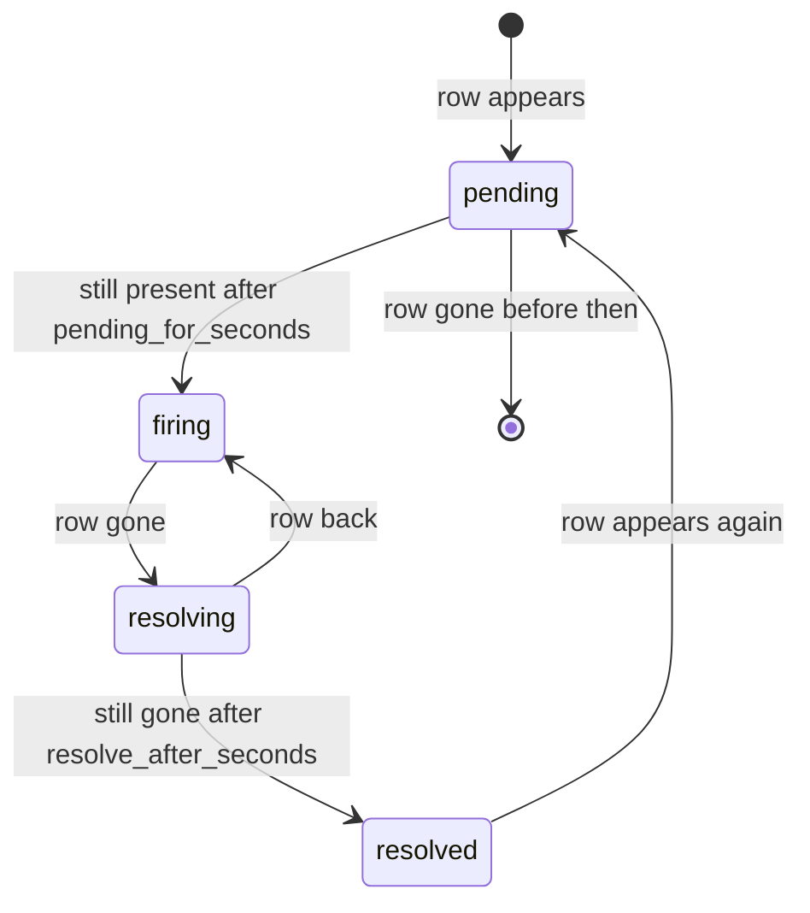

# vgi.alerts.v1

An alert rule is a query that returns the rows meeting a condition. Each row is
an **alert instance**, identified by the rule's key columns, and its other
columns are the instance's details. Instances move through states, people are
notified on transitions rather than on every evaluation, and anyone with access
can acknowledge, snooze or subscribe. Shared conventions are in
[README.md](README.md#shared-conventions); sessions and grants are in
[credentials.md](credentials.md). A host of `vgi.alerts.v1` also hosts
`vgi.delegations.v1`: rules carry no credentials and are evaluated by
reattaching each source with the owner's delegation for it.

**Why not a schedule with a condition.** A schedule delivers every time its
condition holds and has no memory between runs. An alert needs state (notify
when West starts falling short and when it recovers, not every five minutes in
between), one instance per entity, the triggering values in the message, and
people acting on it. Those are this protocol. Either protocol can be hosted
without the other; the reference service runs both on one engine.

## Rules

```python
@dataclass
class AlertRule:
    title: str
    description: str = ""
    severity: str = "warning"            # info | warning | critical
    data_sources: list[DataSource]       # the session to evaluate in (credentials.md)
    setup_sql: str = ""
    sql: str                             # returns the rows meeting the condition
    key_columns: list[str] = []          # identify an instance; empty = one instance at most
    parameters: list[ParameterSpec] = []
    parameter_values: list[ParamValue] = []
    evaluate_every_seconds: int = 300    # at least the evaluator's minimum
    pending_for_seconds: int = 0         # must keep matching this long before firing
    resolve_after_seconds: int = 0       # must stay absent this long before resolving
    repeat_every_seconds: int = 0        # re-notify while firing and unacknowledged; 0 = never
    max_instances: int = 100
    messages: AlertMessages = ...
    owner_destinations: list[Destination] = []
    share_details_with_subscribers: bool = False
    enabled: bool = True

@dataclass
class AlertMessages:
    title_template: str = "{{rule.title}}: {{instance.key}}"
    summary_template: str = ""           # e.g. "{{region}} is {{shortfall | percent}} below target"
    resolved_template: str = ""          # default: "{{instance.key}} recovered"
    field_columns: list[str] = []        # detail columns shown as headline fields
```

The query is the condition. "Any region below target today" is:

```sql
SELECT region, revenue, target, revenue / target - 1 AS shortfall
FROM sales.main.daily_revenue
WHERE day = current_date AND revenue < target
```

with `key_columns = ["region"]`. A row for West means West matches; no row for
West means West doesn't. A yes/no alert is a rule with no key columns whose
query returns one row or none, which is the schedule condition's case made
stateful.

**Evaluation** runs `setup_sql` and `sql` in a session rebuilt from
`data_sources` and the owner's delegations, wherever the implementation runs
it. Parameters bind as in schedules, relative values included, so
`last_n_days:1` works in a rule.

**Result rules.** Key columns must exist and be non-null, and keys must be
unique within one result; a violation is an evaluation error. More than
`max_instances` rows is an evaluation error (`too_many_instances`), never a
silent truncation. Detail values are kept as their Arrow types and rendered by
the templates.

## Instances and states

An instance's id is a hash of `(rule_id, canonical key)`, where the canonical
key is the RFC 8785 JSON of the key columns in `key_columns` order. The same
region therefore maps to the same instance across evaluations and restarts.



- With `pending_for_seconds = 0` an instance fires on first sight; with
  `resolve_after_seconds = 0` it resolves on the first evaluation without it.
- Each instance keeps `first_seen_at`, `fired_at`, `resolved_at`,
  `last_seen_at`, the latest detail values, and the detail values at the moment
  it fired, so "fired at $41k, now $44k" can be shown.
- **Evaluation errors never resolve anything.** If the query fails, a grant is
  rejected or the result breaks the rules above, every instance keeps its state,
  the rule enters `error` with a `RunError` (same kinds and codes as schedule
  runs), and the owner is notified once on entering `error` and once on
  leaving it. Treating a failed query as "no rows" would resolve every alert
  exactly when the data is least trustworthy.
- A resolved instance is kept for history; the reporting catalog shows it.

## Notifications

Notifications go out on transitions, never on every evaluation:

| Event | Sent when | Message |
| --- | --- | --- |
| `firing` | `pending → firing`, or `resolved → … → firing` | `title_template` / `summary_template`, with the detail values |
| `resolved` | `resolving → resolved` | `resolved_template` |
| `repeat` | Still firing, unacknowledged, not snoozed, every `repeat_every_seconds` | As `firing`, marked as a reminder |
| `rule_error` / `rule_recovered` | The rule enters or leaves `error` | To the owner only |

- **Grouped.** Transitions from one evaluation go out as one notification
  per rule ("3 regions below target: West −18%, East −6%, South −2%").
- **Threading.** `thread_key` is the instance id, so a Slack thread or email
  conversation carries one instance's firing, reminders and resolution.
- **Severity** maps to the notify `severity`. **Fields** are the
  `field_columns` of the instance. **Link** opens the instance in Cupola.

**Templates** are logic-less, with `{{column}}`, `{{rule.title}}`,
`{{instance.key}}`, `{{instance.fired_at}}` and a fixed set of formatters:
`number`, `percent`, `currency:<ISO 4217>`, `date`, `datetime`, `duration`,
pinned with test vectors. Channel formatting and escaping are the notify
service's. `create_rule` and `test_rule` reject a template that names a column
the query doesn't return.

## Who sees the details

A rule is evaluated as its owner, so its rows are the owner's data. The
protocol holds no grants for anyone else and can't check what they may see.

- **Owner destinations** (`owner_destinations`, and the owner's own
  subscriptions) get the full message, with details.
- **Other subscribers** get the rule title, the instance key, state, severity,
  times and a link. Opening the link shows details only to someone who may see
  them: the owner, or anyone when the rule shares details. Cupola also offers
  "view with my access", which re-runs the rule's query for that one key with
  the viewer's own session.
- **Sharing details is the owner's explicit choice.**
  `share_details_with_subscribers = true` sends details to every subscriber.
  The rule records who turned it on and when. Notify's destination policy still
  applies.
- Instance keys appear in every notification, so a rule whose key itself is
  sensitive should not have subscribers.

## Acknowledge, snooze, subscribe

Every action records actor, time and note, and appears in the instance or rule
timeline.

- **Acknowledge** an instance ("I'm on West"): stops `repeat` reminders until
  it resolves, and clears on resolve. `set_acknowledged(…, false)` reverses it.
- **Snooze** a rule or an instance until a time, or until the instance next
  resolves. Evaluation and state changes continue; only notifications are held.
  A snooze must end: the evaluator publishes a maximum length, and silencing for
  good means disabling the rule. When a snooze ends on a still-firing instance,
  one `firing` notification goes out marked as after-snooze.
- **Subscribe** the caller to a rule with destinations they choose, subject to
  notify's policy. Subscribers manage only their own subscriptions; the owner
  can remove anyone's.

## Methods

U = unary, S = producer stream. All are required.

| Method | Kind | Purpose |
| --- | --- | --- |
| `get_alerts_info()` | U | Minimum evaluation interval, `max_instances` ceiling, maximum snooze, limits |
| `list_rules(query, owned_by_me, state)` / `get_rule(rule_id)` | S / U | Rules with their state (`ok`, `firing`, `error`, `disabled`) and instance counts |
| `create_rule(request_id, rule)` | U | Owner is the caller; `grant_required` if the owner lacks a grant for a required location |
| `update_rule(rule_id, expected_version, rule)` | U | Includes pausing via `enabled`. Changing the key columns starts new instances; the old ones close as `superseded` |
| `delete_rule(rule_id, expected_version)` | U | Instances close as `superseded` |
| `test_rule(rule)` | U | Evaluate an unsaved rule once: the instances it would create, rendered messages, template errors. Sends nothing |
| `list_instances(rule_id, state, since)` / `get_instance(instance_id)` | S / U | Instances with state and times; detail values only for callers who may see them |
| `set_acknowledged(instance_id, acknowledged, note)` | U | |
| `snooze(rule_id, instance_id, until, until_resolved, reason)` / `unsnooze(snooze_id)` | U | Empty `instance_id` snoozes the rule |
| `subscribe(rule_id, destinations)` / `unsubscribe(subscription_id)` / `list_subscriptions(rule_id)` | U / U / S | |
| `list_events(rule_id, instance_id, since)` | S | Timeline: transitions, notifications, acknowledgements, snoozes, errors |

**Permission hints.** Rules and instances carry `allowed_actions` from the
shared set plus `acknowledge`, `snooze`, `subscribe`, `view_details`.

**Errors** use the shared kinds in [README.md](README.md#errors), plus:

`invalid_request` covers a bad rule (a template column the query doesn't
return, a missing key column, an interval below the minimum) and a snooze past
the maximum, with a `BadRequest` naming the field.

## SQL binding

Schema `alerts`. Derived by the rules in [README.md](README.md#sql-binding); this is the annotation.

| Table | List / get | `INSERT` | `UPDATE` | `DELETE` |
| --- | --- | --- | --- | --- |
| `rules` | `list_rules` / `get_rule` | `create_rule` | `update_rule`, expected = the row's `version` | `delete_rule`, same |
| `instances` | `list_instances` / `get_instance` | | | |
| `events` | `list_events` | | | |

`list_instances` and `list_events` with no `rule_id` cover every rule the
caller can read. `list_subscriptions` has a required `rule_id`, so it stays a
table function. `set_acknowledged`, `snooze`, `unsnooze`, `subscribe`,
`unsubscribe` and `test_rule` are procedures. Detail columns are `NULL` where
the caller may not see them, as over RPC.

```sql
SELECT rule_id, instance_id, state FROM ops.alerts.instances
WHERE state = 'firing';

CALL ops.alerts.set_acknowledged(instance_id := 'i_west', acknowledged := true,
                                 note := 'Investigating');
```

## Conformance

The state machine is pinned with vectors. Each vector is a sequence of
`(time, rows returned or error)` evaluations, plus acknowledgements and
snoozes, with the expected transitions and notifications. The fake clock and
recording notifier in `vgi.testing` run them, so every implementation agrees on
when West fires, reminds and resolves.

## Reference evaluator (non-normative)

- Evaluation is driven by the scheduler's `tick`, so alerts run long-running or
  serverless alike ([schedules.md](schedules.md#reference-scheduler-non-normative)).
  A rule is claimed with the scheduler's per-rule lease, and a missed interval
  is evaluated once, not replayed.
- A fresh DuckDB session and VGI attach cost about 270 ms before the query
  runs, so a long-running evaluator keeps a warm session per rule, rebuilt when
  the rule or the owner's grants change. Serverless evaluators can't, and their
  published minimum interval reflects it (60 s at best, the cron floor).
- Large groups are summarized after 10 instances ("and 14 more") with a link.

## Deferred

- **Escalation and on-call** (escalate if unacknowledged for 30 minutes):
  route to PagerDuty or Opsgenie through a signed notify webhook for now.
- **Dependencies and inhibition** (don't page for each region when the warehouse
  is down).
- **Anomaly and change rules** (more than 3σ from the 28-day mean); expressible
  today in the rule's SQL, without a built-in.
- **Event-driven evaluation** when a source refreshes, instead of polling.
