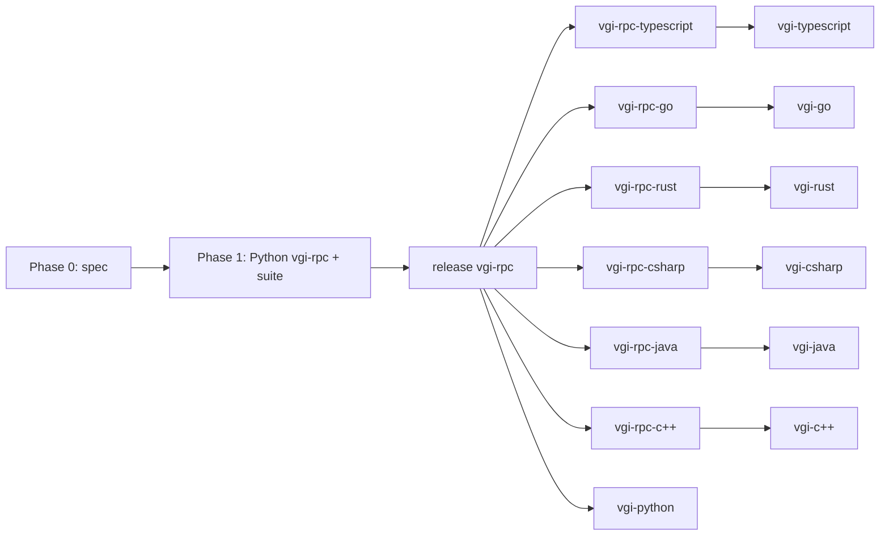

# Prerequisites: multi-protocol hosting across vgi-rpc and the VGI SDKs

Status: **done** · planned 2026-10-05, released 2026-10-06 (see [Outcome](#outcome))

Before any reporting protocol can ship, every vgi-rpc port and every VGI SDK
must let a worker host additional protocols, classify transient errors with a
retry hint, and host `vgi_rpc.Identity.v1`. This plan covers 1 spec, 7 vgi-rpc
ports and 7 VGI SDKs. Rowfence is deferred.

## Decisions

| # | Decision | Consequence |
| --- | --- | --- |
| D1 | **The protocol is the unit of optionality.** No method subsets and no feature tokens for application protocols. A capability that is optional becomes its own protocol. | No narrowing API. Reflection `features` stays emitted-empty; the spec says so explicitly. Identity keeps its existing hook-based narrowing, untouched. |
| D2 | **A worker supplies a list of `(protocol, implementation)` pairs when its server is built.** The list may be computed from configuration or environment, and is fixed for the life of the process. | Reflection output and protocol hashes stay stable per process. The same list is hosted on every transport. |
| D3 | **Identity stays framework-owned, and lands in all seven SDKs now.** It keeps the reserved `vgi_rpc.` name and its guards, is opted into through `resolve_token` / `mint_grant` hooks rather than the worker's list, and is hosted on transports that authenticate callers (HTTP). | Every SDK gets the same opt-in and the same refuse-to-start rule when introspection is enabled without an allowlist. |
| D4 | **Errors take gRPC's shape.** A closed set of canonical codes (`vgi_rpc.error_code`), the existing open `error_kind` as the fine-grained reason, and a list of typed details from a fixed catalog (`vgi_rpc.error_details`). Rules below. | Clients get a uniform retry and handling policy from the code alone. Transient errors carry `RetryInfo`. Later protocols reuse the catalog (e.g. a revision conflict as `ABORTED` + `ResourceInfo`). |
| D5 | Rowfence routing is out of scope. | Rowfence still forwards only `Identity.v1/issue_grant`. |
| D6 | **The cross-SDK checks live in vgi-rpc-python's conformance suite.** Every SDK fixture worker hosts the same `conformance.Secondary.v1` the ports use. | One fixture protocol and one test group serve both the ports and the SDKs. |

### Error model (adopted from gRPC)

gRPC's `google.rpc.Status` model (canonical codes, a reason, and typed
details from `error_details.proto`, with
[AIP-193](https://google.aip.dev/193) as the usage guide) has held up across
many languages for years. We adopt its shape, and fix the parts that caused
trouble in practice.

**Three layers on every EXCEPTION batch:**

| Layer | Wire | Set | Purpose |
| --- | --- | --- | --- |
| Code | `vgi_rpc.error_code`, the code's name, e.g. `UNAVAILABLE` | **Closed**: gRPC's 16 codes minus `OK` | Generic handling: retry or not, how to show it, and later the HTTP status a proxy maps it to |
| Reason | `vgi_rpc.error_kind`, unchanged, e.g. `identity_unavailable` | Open; unique within the protocol that raised it | What a client branches on. The pair (protocol, kind) is gRPC's (domain, reason) |
| Details | `vgi_rpc.error_details`, a JSON array of typed objects | Fixed catalog below | Machine-readable specifics: retry delay, which field, which resource |

`error_message` stays developer-facing English, as in gRPC.

**Detail catalog.** Each object names its type in `@type`, mirroring
protobuf's JSON form for `Any`. Field names follow gRPC's, in snake_case:

| `@type` | Fields | Use |
| --- | --- | --- |
| `vgi_rpc.ErrorInfo` | `metadata: {string: string}` | Extra context for the reason. Reason and domain are already `error_kind` and the protocol, so they aren't repeated |
| `vgi_rpc.RetryInfo` | `retry_delay_seconds: number` | How long to wait before retrying |
| `vgi_rpc.BadRequest` | `field_violations: [{field, description}]` | Which inputs were wrong |
| `vgi_rpc.PreconditionFailure` | `violations: [{type, subject, description}]` | What state must change first |
| `vgi_rpc.QuotaFailure` | `violations: [{subject, description}]` | Which limit was hit |
| `vgi_rpc.ResourceInfo` | `resource_type, resource_name, owner, description` | Which object the error concerns |
| `vgi_rpc.Help` | `links: [{description, url}]` | Where to read more |
| `vgi_rpc.LocalizedMessage` | `locale, message` | Text safe to show an end user |

`DebugInfo` is deliberately absent (see Tracebacks below).

**Rules:**

- **The code is required whenever `error_kind` is set.** Each kind maps to
  exactly one code, fixed where the kind is defined. Errors with no kind get
  `UNKNOWN`; framework faults get `INTERNAL`.
- **Details come only from the catalog.** A protocol may define its own detail
  type only under its own name (`vgi.reports.v1.SomeDetail`), and should prefer
  `ErrorInfo.metadata`. This avoids the gRPC failure of every service
  inventing its own detail messages.
- **Each type appears at most once** in a details list, as AIP-193 requires.
- **Clients ignore detail types they don't know**, and never require details.
- **Bounded.** The serialized details array is at most 4 KiB. A server that
  would exceed it drops the whole array, not part of it.
- **No secrets.** Details MUST NOT carry credentials, tokens or user data.
- **Retryability follows the code.** `UNAVAILABLE`, and `RESOURCE_EXHAUSTED`
  when it carries `RetryInfo`, are retryable; when `RetryInfo` is present a
  retry waits at least that long. `ABORTED` means retry the whole operation at
  a higher level. Everything else is final. Clients expose an `is_retryable`
  check but do **not** retry RPC errors automatically: as in gRPC, automatic
  retry is opt-in, because a method may not be idempotent.

**What we fix from gRPC's experience:**

- **Details invisible to clients and logs.** gRPC put details in a
  binary trailer (`grpc-status-details-bin`), so many clients, proxies and
  logs never decoded them. Here the code, kind and details are plain top-level
  metadata, written into the access log, and conformance-tested in every
  client.
- **Truncation.** gRPC proxies silently drop oversized trailers. Our 4 KiB cap
  drops the whole array explicitly.
- **`UNKNOWN` overuse.** gRPC services return `UNKNOWN` for everything they
  didn't classify. Every kind we define names its code, and conformance pins
  the mapping.
- **Stack traces.** gRPC keeps `DebugInfo` out of production responses. We
  chose the opposite default deliberately: tracebacks are **included by default
  on every transport**, behind one operator switch, because the DuckDB extension
  surfaces the remote traceback in the error a user sees, and hiding it on HTTP
  hid the cause of real failures. A language with no native stack synthesizes
  one, so `log_extra.traceback` is never empty while the switch is on.

**Codes for the existing kinds:**

| `error_kind` | Code | Details |
| --- | --- | --- |
| `method_not_implemented` | `UNIMPLEMENTED` | |
| `protocol_not_supported` | `UNIMPLEMENTED` | |
| `protocol_not_specified` | `INVALID_ARGUMENT` | |
| `protocol_version_mismatch` | `FAILED_PRECONDITION` | `PreconditionFailure` |
| `session_lost` | `ABORTED` | |
| `server_draining` | `UNAVAILABLE` | `RetryInfo` |
| `identity_unavailable` | `UNAVAILABLE` | `RetryInfo` (required) |
| `stale_auth` | `UNAUTHENTICATED` | |
| `introspection_refused` | `PERMISSION_DENIED` | |
| `grant_refused` | `PERMISSION_DENIED` | |
| `token_unresolved` | `NOT_FOUND` | |

## What the audit found

**Spec rules ports already break.** These need no spec change, only fixes:

- §3.1 says a server MUST refuse an application protocol named `vgi_rpc.*`.
  Rust never checks the application name, C++ doesn't check at all, and C#
  checks only names declared with `[ProtocolName]`.
- §8 says the client MUST surface `error_kind`. The Python, TypeScript and Rust
  clients drop it.
  - Root cause: `CLIENT_DRIVER_PROTOCOL.md`'s error object has no `error_kind`
    field, so client conformance never checked it.

**The spec doesn't say these.** All seven ports get them wrong, which is a sign
the spec is the cause:

- `retry_after` exists on `IdentityUnavailableError` in every port but reaches
  the wire in none.
- When an identity hook raises the port's "auth unavailable" error, only
  TypeScript and Rust translate it to `identity_unavailable`. Python, Go, C#,
  Java and C++ send it unclassified.
  - vgi-python's own docs tell workers to raise that error type
    (`vgi/worker.py:1460`, `CLAUDE.md`).
- Nothing says how an application registers several protocols. Only Python
  (`extra_protocols`) and TypeScript (`addProtocol`) can. Go's `AddProtocol`
  takes an unexported type, and Rust, C#, Java and C++ host exactly
  primary + Reflection + Identity.

**SDKs:**

- No SDK lets a worker add a protocol.
- Only vgi-python hosts Identity, and only over HTTP.
- vgi-python and vgi-typescript construct their server in 5 places each.
- Go, Rust, C#, Java and C++ each have one builder.

**Out of scope:**

- vgi-rpc-swift contains only a Claude Code settings file.
- vgi-kotlin is retired.

## Phase 0 — Spec (vgi-rpc repo)

1. **`docs/WIRE_PROTOCOL.md` §3.1, "Hosting several application protocols."**
   - A server MUST let an application register any number of application
     protocols at construction, each `(name, version, implementation)`.
   - The registered set is fixed for the server's lifetime and is the same on
     every transport the server is offered on.
   - The reserved-prefix rule applies to every registered protocol, however its
     name was derived.
   - `list_protocols` lists application protocols in registration order, the
     primary first. The client driver's `describe` op already relies on "first
     non-reserved protocol".
2. **§8, "Error model."**
   - New keys `vgi_rpc.error_code` and `vgi_rpc.error_details`, EXCEPTION
     batches only, also mirrored in `log_extra`.
   - Normative text for the three layers, the detail catalog, the rules and the
     retry policy above.
   - The error-kinds table gains code and details columns, as above.
   - The traceback switch, on by default on every transport.
3. **§16, "Identity."**
   - `identity_unavailable` MUST carry `RetryInfo`.
   - A `resolve_token` or `mint_grant` hook that raises the port's transport-auth
     "unavailable" error MUST be emitted as `identity_unavailable` with that
     error's retry hint, never unclassified. That is the TypeScript and Rust
     behaviour today.
4. **§14, "Reflection."** `features` is reserved and MUST be emitted as an empty
   list in this version; clients MUST ignore its contents.
5. **`tools/cross-port/specs/CLIENT_DRIVER_PROTOCOL.md`.** Add `error_code`
   (string, `""` when absent), `error_kind` (string, `""` when absent) and
   `error_details` (array, `[]` when absent) to the structured error object.
6. **`tools/cross-port/specs/IDENTITY_CONFORMANCE_FIXTURE.md`.** Add a reserved
   test token that makes the fixture's resolver raise the port's
   auth-unavailable error with a retry hint of 7 seconds.
7. **New decision record, `tools/cross-port/specs/MULTI_PROTOCOL_HOSTING.md`,**
   in the `IDENTITY_V1_SPEC.md` style:
   - the decisions above, with reasons
   - the conformance fixture protocol (Phase 1)
   - per-port deliverables
   - the pinned protocol hash for the fixture protocol
8. **`docs/porting-guide.md`.** A checklist entry for each item above.

Commit titles name the finding, e.g. "§8 never said how a retry hint reaches
the client, and all seven ports dropped it".

## Phase 1 — Python reference (vgi-rpc)

1. **Error model.**
   - A `Code` enum and the detail catalog as dataclasses in `vgi_rpc`, with
     `to_json` / `from_json`.
   - Every error class with an `error_kind` also declares its `error_code`.
     Classes may supply `error_details`.
   - `Message.from_exception` (`vgi_rpc/log.py:207`) writes code, kind and
     details to the top-level keys and `log_extra`, enforcing the cap.
   - `IdentityUnavailableError` and `AuthUnavailableError` supply `RetryInfo`.
   - One server switch for tracebacks, on by default on every transport.
   - Access-log records gain `error_code`.
2. **Client.**
   - `RpcError` (`vgi_rpc/rpc/_common.py:688`) gains `error_code`,
     `error_kind` and `error_details`, plus typed accessors
     (`retry_info()`, `bad_request()`, …), filled on every decode path: pipe,
     HTTP, stream, and external.
   - `is_retryable()` on `RpcError`, following the rule above. No automatic retry.
   - `client_driver.py` reports all three.
3. **Identity translation.** `IdentityImpl` catches `AuthUnavailableError` from
   either hook and raises `IdentityUnavailableError(detail, retry_after=...)`.
   This also makes vgi-python's documented advice correct.
4. **Reflection.** No code change; `features=[]` is now what the spec requires.
5. **Conformance fixture protocol.** The conformance worker hosts a second
   application protocol, `conformance.Secondary.v1`, through `extra_protocols`.
   - `echo(value: str) -> str`. The primary also has a method of this name, so
     routing by `(protocol, method)` is exercised.
   - `fail(code: str, kind: str, retry_delay_seconds: float)`: raises an error
     with that code and kind, plus `RetryInfo` when the delay is positive.
   - `fail_oversized()`: raises an error whose details exceed 4 KiB.
6. **Conformance tests** (`vgi_rpc/conformance/`, run against every port on
   every transport):
   - The secondary is listed second by `list_protocols`, and `describe` works.
   - `echo` routes by pair and the same-named primary method stays distinct.
   - `fail` round-trips `error_code`, `error_kind` and `error_details`.
   - The Identity fixture's auth-unavailable token yields `UNAVAILABLE` /
     `identity_unavailable` with `RetryInfo` of 7 seconds.
   - Every existing kind carries the code in the mapping table.
   - Tracebacks are present by default on every transport and absent when the
     switch is off.
   - Detail rules: unknown detail types are ignored by clients; an array over
     4 KiB is dropped whole.
   - Client role: through `client_driver`, each port's client reports
     `error_code`, `error_kind` and `error_details` from the reference server.
   - **Hosted-protocols group, for SDK workers.** Takes a worker command or
     URL plus the expected protocol list. It asserts that reflection lists
     every expected protocol in order, that `conformance.Secondary.v1` passes
     the group above, and, over HTTP when the fixture opts in, that
     `vgi_rpc.Identity.v1` is listed and passes the Identity fixture tests.
     It runs on stdio, unix and HTTP.
7. **Tooling.** `tools/cross-port/describe_diff.py` compares the secondary's
   hash across ports.
8. **Release.** vgi-rpc to PyPI (remote `upstream`), before anything consumes it.

## Phase 2 — The six other vgi-rpc ports

Same deliverables in each, verified by the Phase 1 suite in both directions:
the port's server against the reference client, and the port's client against
the reference server.

| Port | Public hosting API to add | Reserved prefix | Emit code + details; traceback setting | Translate auth-unavailable | Client exposes code / kind / details |
| --- | --- | --- | --- | --- | --- |
| TypeScript | Launchers (`serveTcp`, `serveUnix`, `serveStream`) accept a protocol host with extra protocols, closing the gap noted at `server.ts:177` | ok | add | ok | add both (`log-batch.ts:33`) |
| Go | Exported binding constructor, so `AddProtocol` works outside the package | ok | add | add (`identity_v1.go:587`) | detail; use `errors.As` for kind (`wire.go:251`) |
| Rust | Builder method to add a protocol with its dispatcher | add on the application name (`server.rs:561`) | add (`server.rs:1989`) | ok | add both (`envelope.rs:57`) |
| C# | Constructor or builder accepting additional `(interface, implementation)` pairs | extend to derived names | add | add (`IdentityImpl.cs:134`) | detail |
| Java | `addProtocol(Class<?>, Object)` beside `setIdentity` | ok | add (`Wire.java:232`) | add (`IdentityImpl.java:198`) | detail |
| C++ | `ServerBuilder::add_protocol(...)` | add (`server.cpp:129`) | add (`result.cpp:80`) | add (`token_identity.cpp:481`) | detail |

Each port's conformance worker hosts `conformance.Secondary.v1`, and its client
driver reports `error_code`, `error_kind` and `error_details`. Releases follow the per-repo
mechanics (crates.io and Go on tag push, npm and Maven on release). The VGI SDKs
that depend on these ports wait for each release.

## Phase 3 — The seven VGI SDKs

**Common contract.**

- **Hook.** A worker overrides one hook that returns its additional protocols as
  `(protocol, implementation)` pairs. It is called once when the server is built,
  may consult configuration, and its result is hosted on every transport the
  worker serves.
- **Identity.** Hosted when the worker implements `resolve_token` and/or
  `mint_grant`, on HTTP. Enabling introspection without an allowlist of
  principals refuses to start. This is vgi-python's existing rule, ported.

| SDK | Work |
| --- | --- |
| vgi-python | `build_rpc_server(worker, transport)` replaces the 5 `RpcServer(...)` calls (`vgi/serve.py:321`, `:612`; `vgi/worker.py:1727`, `:5565`, `:5644`). Add `Worker.hosted_protocols(cls) -> Sequence[tuple[type, object]]`. Iroh gets the same set. Docs: `AuthUnavailableError` is now correct advice; say why. |
| vgi-typescript | Consolidate its 5 sites (`worker.ts:198`, `:223`, `:248`, `:289`; `http/fetch.ts:200`) into one builder; add the hook; add Identity opt-in with the allowlist rule. |
| vgi-go | Hook and Identity in `buildServer` (`vgi/worker.go:1235`). |
| vgi-rust | Hook and Identity in `build_parts` (`vgi/src/worker.rs:297`). |
| vgi-csharp | Hook and Identity in `NewRpcServer` (`Worker.cs:381`). |
| vgi-java | Hook and Identity in `buildServer` (`Worker.java:1138`); bump the vgirpc dependency and the `VGI_RPC_JAVA_REF` CI pins. |
| vgi-c++ | Hook and Identity in `Worker::run` (`worker.cpp:231`). |

**Fixture and test.**

- Each SDK's example fixture worker hosts `conformance.Secondary.v1` through
  its new hook. This is additive: no existing fixture function changes.
- Over HTTP, the fixture worker also opts into Identity with the policy from
  `IDENTITY_CONFORMANCE_FIXTURE.md`, including the auth-unavailable test token.
- Acceptance is vgi-rpc-python's hosted-protocols group (Phase 1, item 6), run
  against each SDK's fixture worker with the expected list `vgi.v2`,
  `conformance.Secondary.v1`.
- Each SDK's CI runs that group, the way the ports already run the shared
  suite.

## Order and parallelism

- Phases 0 and 1 are sequential and done in this session.
- The six ports are independent. Each can run as its own agent in its own
  repo, with the shared suite as the acceptance test.
  - Agents must not share a scratch directory or run suites concurrently on
    one machine; that has corrupted results before.
- Each SDK follows its transport's release.

## Definition of done

- The cross-port conformance run prints `CONFORMANCE PASSED (all transports)`,
  including the new secondary-protocol and error-detail groups. This holds in
  both directions for all seven ports.
- `describe_diff.py` reports identical hashes for `conformance.Secondary.v1`.
- Each of the seven SDKs:
  - hosts a worker-supplied protocol on every transport
  - hosts Identity over HTTP when opted in
  - passes the hosted-protocols group
- Every repo's own CI is green, including vgi-python's `mypy tests/`,
  `ruff format --check` and the Windows matrix.

## Outcome

Everything above shipped on 2026-10-06, followed the same day by grants
accepted as bearer credentials (vgi-rpc `GRANT_AUTHENTICATION.md`), which the
reporting design needs for unattended runs.

| Language | vgi-rpc port | VGI SDK |
| --- | --- | --- |
| Python | vgi-rpc 0.49.0 | vgi-python 0.42.0 |
| TypeScript | vgi-rpc-typescript 0.27.0 | vgi-typescript 0.40.0 |
| Go | vgi-rpc-go 0.32.0 | vgi-go 0.31.0 |
| C# | vgi-rpc-csharp 0.14.0 | vgi-csharp 0.15.0 |
| Java | vgi-rpc-java 0.29.0 | vgi-java 0.38.0 |
| Rust | vgi-rpc-rust 0.30.0 | vgi-rust 0.40.0 |
| C++ | vgi-rpc-cpp 0.7.0 | vgi-cpp 0.7.0 |

Versions are the grant-acceptance releases; the hosting and error-model work
landed in earlier releases.

**Differences from this plan:**

- Tracebacks default on everywhere (above), not off on HTTP.
- `revoke_grant` and a `GrantAuthenticator` were not built. Sealed grants are
  stateless and not individually revocable; a short framework maximum lifetime
  and key rotation stood in. The reporting design now makes lifetime the
  worker's policy (see [credentials.md](credentials.md)).

**Still open from this round:**

- `IDENTITY_V1_SPEC.md` §9.3 doesn't say what happens when a deployment's own
  authenticator returns anonymous for a bearer it doesn't recognise. The
  reference stays anonymous; Java and Rust return 401.
- vgi-rpc `TestSticky::test_expired_session_surfaces_session_lost` is flaky on
  macOS CI.
