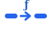
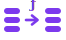
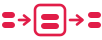

# Function patterns

**What this is:** a recipe showing each of the four VGI function shapes, with a complete,
runnable worker for each. **Who it's for:** developers who've finished the
[tutorial](../tutorial/index.md) and want to know which pattern fits their problem.

## Prerequisites

- You can build and run a worker (see the [tutorial](../tutorial/index.md)).
- Python 3.13+, `uv`, and a DuckDB-compatible engine (Haybarn or stock DuckDB).

## Which pattern do I need?

<div class="kind-gallery">
<a class="kind-gallery__card kind-gallery--scalar" href="#scalar">

<span class="kind-gallery__name">Scalar</span>
<code class="kind-gallery__formula">1 row → 1 value</code>
</a>
<a class="kind-gallery__card kind-gallery--table" href="#table">

<span class="kind-gallery__name">Table</span>
<code class="kind-gallery__formula">args → N rows</code>
</a>
<a class="kind-gallery__card kind-gallery--table-in-out" href="#table-in-out">

<span class="kind-gallery__name">Table-in-out</span>
<code class="kind-gallery__formula">N rows → M rows</code>
</a>
<a class="kind-gallery__card kind-gallery--aggregate" href="#aggregate">

<span class="kind-gallery__name">Aggregate</span>
<code class="kind-gallery__formula">N rows → 1 value</code>
</a>
<a class="kind-gallery__card kind-gallery--buffering" href="#buffering">

<span class="kind-gallery__name">Buffering</span>
<code class="kind-gallery__formula">stream → [state] → stream</code>
</a>
</div>

| Pattern | Shape | Use it when… | SQL |
|---|---|---|---|
| **Scalar** | 1 row → 1 row | you transform each row independently | `SELECT f(col) FROM t` |
| **Table** | args → N rows | you generate rows from arguments | `SELECT * FROM f(args)` |
| **Table-in-out** | N rows → M rows | you reshape/filter a streamed table | `SELECT * FROM f((SELECT …))` |
| **Aggregate** | grouped rows → 1 row/group | you accumulate per `GROUP BY` group | `SELECT f(col) FROM t GROUP BY k` |
| **Buffering** | stream → [state] → stream | you must see *every* row first (sort, top-k, full reduction) | `SELECT * FROM f((SELECT …))` |

## Scalar

<div class="kind-banner kind-banner--scalar" markdown>
{ .kind-banner__glyph }
<div class="kind-banner__text" markdown>
`1 row → 1 value`{ .kind-banner__formula }

Runs on each row independently and returns a single value — a pure per-row transform.
{ .kind-banner__desc }
</div>
</div>

One row in, one row out. Operate on the whole column with `pyarrow.compute`; the `Annotated`
types are the schema.

```python
--8<-- "examples/calc_scalar_worker.py"
```

```sql
ATTACH 'calc' (TYPE vgi, LOCATION 'uv run calc_scalar_worker.py');
SELECT calc.double(n) FROM (VALUES (1), (2), (3)) AS t(n);
```

Scalars aren't just for numbers — any column type works. A string transform looks the same; here
`compute` joins `Hello, ` + name + `!` across the column:

```python
--8<-- "examples/greeting_scalar_worker.py"
```

```sql
SELECT greetings.greeting(name) FROM (VALUES ('Alice'), ('Bob')) AS t(name);
```

## Table

<div class="kind-banner kind-banner--table" markdown>
{ .kind-banner__glyph }
<div class="kind-banner__text" markdown>
`args → N rows`{ .kind-banner__formula }

A table-valued source: scalar arguments in, a whole set of rows out.
{ .kind-banner__desc }
</div>
</div>

Generate rows from arguments, no input table. Declare a typed args dataclass and a `FIXED_SCHEMA`;
`process` emits batches until `out.finish()`. The `@bind_fixed_schema` / `@init_single_worker`
decorators wire up the common single-worker lifecycle. (This is the full tutorial worker — the
scalar `double` plus the `series` generator.)

```python
--8<-- "examples/calc_worker.py"
```

```sql
ATTACH 'calc' (TYPE vgi, LOCATION 'uv run calc_worker.py');
SELECT * FROM calc.series(3);
```

### Streaming with state

The tutorial's `series` emits every row in a single `process` call. That's fine for small results,
but `process` is actually called *repeatedly* until you call `out.finish()` — so for large output
you emit a bounded chunk per call and remember your place in a small **state** object. The state
extends `ArrowSerializableDataclass` so it survives HTTP state round-trips:

```python
--8<-- "examples/series_streaming_worker.py"
```

```sql
SELECT * FROM calc.series(1000000);   -- streamed CHUNK rows per process() call
```

## Table-in-out

<div class="kind-banner kind-banner--table-in-out" markdown>
{ .kind-banner__glyph }
<div class="kind-banner__text" markdown>
`N rows → M rows`{ .kind-banner__formula }

Consumes a relation and streams a transformed relation back, batch by batch.
{ .kind-banner__desc }
</div>
</div>

Stream an input table through, batch by batch, emitting transformed output. `on_bind` declares the
output schema; `process` receives each input `batch` and emits results. Here we keep only rows
whose `value` column is positive.

```python
--8<-- "examples/filter_worker.py"
```

```sql
ATTACH 'filters' (TYPE vgi, LOCATION 'uv run filter_worker.py');
SELECT * FROM filters.filter_positive((SELECT * FROM my_table));
```

## Aggregate

<div class="kind-banner kind-banner--aggregate" markdown>
{ .kind-banner__glyph }
<div class="kind-banner__text" markdown>
`N rows → 1 value`{ .kind-banner__formula }

Folds many rows down into a single value per group.
{ .kind-banner__desc }
</div>
</div>

Accumulate input rows into per-group state, then emit one row per group. Aggregates are driven by
DuckDB's `GROUP BY` and run in three phases — `update` (fold a batch into per-group state),
`combine` (merge partial states across parallel workers), and `finalize` (state → output row).

```python
--8<-- "examples/sum_worker.py"
```

```sql
ATTACH 'aggregates' (TYPE vgi, LOCATION 'uv run sum_worker.py');
SELECT category, aggregates.vgi_sum(value) FROM t GROUP BY category;
```

??? info "State must be an `ArrowSerializableDataclass`"
    Table generators and aggregates keep state between calls. Because that state is serialized
    across parallel workers (aggregates) and HTTP round-trips, the framework requires it to extend
    `ArrowSerializableDataclass`. Annotate fields with `ArrowType(...)` so the wire type is
    explicit.

## Buffering

<div class="kind-banner kind-banner--buffering" markdown>
{ .kind-banner__glyph }
<div class="kind-banner__text" markdown>
`stream → [state] → stream`{ .kind-banner__formula }

Holds every input row in state before emitting — the basis for sorts, top-k, and full-stream reductions.
{ .kind-banner__desc }
</div>
</div>

When a function must see the **whole** input before it can produce *any* output — a global sort,
top-k, or a full reduction — use a buffering function. Unlike table-in-out (which emits per input
batch), it runs in three phases: `process` (the **sink** — stash each batch, return a `state_id`),
`combine` (reduce all the partials once), and `finalize` (the **source** — stream the result out).
Because the phases can run in different worker processes, state lives in `params.storage` (shared
storage scoped by `execution_id`), not in memory.

```python
--8<-- "examples/row_count_worker.py"
```

```sql
ATTACH 'buffers' (TYPE vgi, LOCATION 'uv run row_count_worker.py');
SELECT * FROM buffers.row_count((SELECT * FROM big_table));
```

??? info "Buffering vs. table-in-out"
    Both consume a relation, but a **table-in-out** function emits *per input batch* and never
    holds the whole input — use it for streaming transforms (filter, enrich, reshape). Reach for
    **buffering** only when output genuinely depends on every row. See
    [Persist state across workers](state-storage.md) for the storage backends `params.storage` uses.

## Next steps

- **Persist state across invocations** → [State storage](../shared-storage.md).
- **Let the optimizer prune work** → [Filter pushdown](../filter-pushdown.md) and
  [Column statistics](../column-statistics.md).
- **Understand the call lifecycle** → [Concepts: lifecycle](../lifecycle.md).
- **Exact signatures** → [API Reference: Functions](../api/functions.md).
