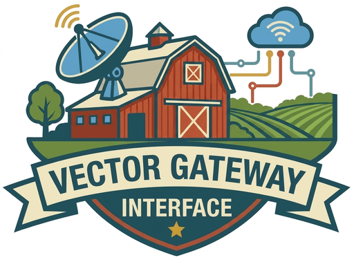

# vgi-python

**Vector Gateway Interface** — extend DuckDB with functions written in Python (or any language),
communicating over Apache Arrow IPC. No C++/Rust/Zig compilation, no linking, no extension
versioning. Just ship a script.

<p align="center">
  
</p>

Built by [🚜 Query.Farm](https://query.farm).

## See it in action

```python
# my_worker.py
# /// script
# requires-python = ">=3.13"
# dependencies = ["vgi-python"]
# ///
from typing import Annotated
from vgi import ScalarFunction, Param, Returns, Worker
from vgi.catalog import Catalog, Schema
import pyarrow as pa
import pyarrow.compute as pc

class Greeting(ScalarFunction):
    """Generate a greeting for each name."""

    @classmethod
    def compute(
        cls,
        name: Annotated[pa.StringArray, Param(doc="Column containing names")],
    ) -> Annotated[pa.StringArray, Returns()]:
        return pc.binary_join_element_wise("Hello, ", name, "!", "")

class MyWorker(Worker):
    catalog = Catalog(name="my_worker", schemas=[Schema(name="main", functions=[Greeting])])

if __name__ == "__main__":
    MyWorker().run()
```

The `# /// script` block is [inline script metadata](https://packaging.python.org/en/latest/specifications/inline-script-metadata/):
`uv run my_worker.py` provisions an isolated environment with `vgi-python` and runs the worker — no
virtualenv to create.

```sql
INSTALL vgi FROM community;
LOAD vgi;
-- LOCATION is the command that launches the worker.
ATTACH 'my_worker' (TYPE vgi, LOCATION 'uv run my_worker.py');

SELECT my_worker.greeting(name) FROM users;
-- "Hello, Alice!"
-- "Hello, Bob!"
```

That's it. No compilation, no extension versioning, no build process.

## Installation

The package is published on PyPI as `vgi-python` (the `vgi` name was taken), but you `import vgi`
in code:

```bash
pip install vgi-python      # or: uv add vgi-python
```

You also need a DuckDB-compatible engine. [Haybarn](https://github.com/Query-farm-haybarn/haybarn),
Query.Farm's DuckDB distribution, ships the `vgi` extension and runs with no install:

```bash
uvx haybarn-cli            # interactive SQL session
```

Stock `duckdb` works too — `INSTALL vgi FROM community; LOAD vgi;`.

## Why VGI?

| Traditional extensions | VGI workers |
|---|---|
| C/C++ compilation required | Any language; Python, TypeScript, Go today |
| Tied to a DuckDB version | Version independent |
| Complex build/release cycle | Ship a script or executable |
| Runs in-process | Process isolation |
| Single-threaded | Parallel workers |

**Use cases:** call REST APIs from SQL, run ML inference, process data with pandas/numpy, build
custom ETL transforms, expose external data sources as queryable tables and views.

## Function patterns

| Type | Base class | SQL pattern | Use case |
|---|---|---|---|
| **Scalar** | `ScalarFunction` | `SELECT func(col) FROM t` | Per-row transforms (1:1) |
| **Table** | `TableFunctionGenerator` | `SELECT * FROM func(args)` | Generate data |
| **Table-in-out** | `TableInOutFunction` | `SELECT * FROM func((SELECT ...))` | Streaming transforms, filtering |
| **Aggregate** | `AggregateFunction` | `SELECT func(col) ... GROUP BY` | Grouped accumulation |

See the [API Reference](api/index.md) for the full surface, or jump into the guides below.

## Documentation

- **[Tutorial](tutorial/index.md)** — build your first worker (scalar + table function callable
  from DuckDB) in about 20 minutes. **Start here.**
- **[How-to guides](how-to/index.md)** — task-oriented recipes: function patterns, catalogs,
  state, auth/HTTP, and optimizer integration.
- **[Concepts](concepts/index.md)** — how it works: the worker lifecycle, transports, and the
  Arrow data model.
- **[API Reference](api/index.md)** — auto-generated from the source, organized by module.

## Project links

- Source: [github.com/Query-farm/vgi-python](https://github.com/Query-farm/vgi-python)
- PyPI: [vgi-python](https://pypi.org/project/vgi-python/)
- Built on [vgi-rpc](https://vgi-rpc-python.query.farm/) — the transport-agnostic RPC layer.
